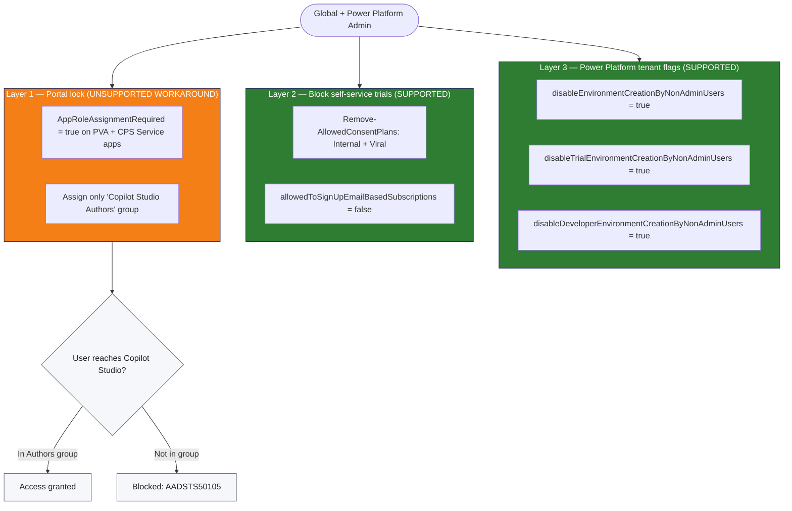

# Solution Brief: Block Copilot Studio tenant-wide, restrict to one Entra security group

| Field | Value |
|---|---|
| Customer goal | Block Microsoft Copilot Studio for all users; allow only members of the `Copilot Studio Authors` Entra group. Trigger: unlicensed users reached the CPS portal and created environments. |
| Fix support status | 🟠 **Partial** — Layers 2 & 3 = Microsoft-supported; **Layer 1 = community workaround (unsupported)**, kept by operator decision as explicit hardening with the honest label. |
| Source of truth | `change-research.md` (2026-05-27, 16 official sources) + `tenant-verification.md` (2026-05-27, demo tenant `M365CPI90282478`) |
| Confidence | Layers verified in-tenant: app-lock applied, consent plans empty, env flags True, Entra flag still permissive. `[tenant-verified: 2026-05-27]` |

---

## 1. The challenge        <!-- slide 2 -->
| What | Impact on customer |
|---|---|
| Unlicensed / unintended users reach `copilotstudio.microsoft.com` | Shadow agents created outside governance |
| Same users self-create Teams / Power Platform environments | Sprawl, ungoverned Dataverse, data-residency exposure |
| The PPAC "authors" setting alone does not revoke access | Admins assume access is locked; it is not |

**Headline stat for slide 2:** access is granted if **ANY of 3** independent conditions is true — so a single control never blocks.

---

## 2. Root cause           <!-- slide 3 -->
| The Microsoft behavior | Status | Official source | Date | Confidence |
|---|---|---|---|---|
| Access granted if **any** of: (1) in authors group, (2) CPS/trial license, (3) M365 Copilot license | GA | learn.microsoft.com/troubleshoot/power-platform/copilot-studio/licensing/authors-access | 2026-05-27 | tenant-verified |
| Self-service viral/internal trial sign-up ON by default | GA | learn.microsoft.com/power-platform/admin/powerapps-powershell | 2026-05-27 | tenant-verified (consent plans now empty) |
| Non-admin environment creation (incl. trial/dev) ON by default | GA | learn.microsoft.com/power-platform/admin/control-environment-creation | 2026-05-27 | tenant-verified (flags now True) |

**Official supported fix?** **Partial.** Microsoft documents *blocking access* (deny the 3 license/group conditions) and *stopping trials* (consent plans + Entra authorization-policy flag + MSCommerce) — these are supported (Layers 2 & 3). Microsoft does **NOT** document restricting Copilot Studio by setting `AppRoleAssignmentRequired` on the two first-party enterprise apps (Layer 1) — that is an **unsupported community workaround**.

---

## 2b. Documented ≠ Actual   <!-- slide 3b — REQUIRED, gap found in tenant -->
| Microsoft documents | Verified in the demo tenant (2026-05-27) |
|---|---|
| Removing the Copilot Studio license/service plan removes CPS access | HadarC's `COPILOT_STUDIO_IN_COPILOT_FOR_M365` plan is **already disabled** — yet HadarC still has access |
| — | **Why:** HadarC is still a member of `Copilot Studio Authors` (grant condition 1) **and** holds an Enabled `PowerAppsService` plan (Power Platform vector) |
| `allowedToSignUpEmailBasedSubscriptions=$true` shown in a "block" snippet | Actual current value `True` = **allowed**; **set `$false` to block** (doc snippet reads backwards — resolved in-tenant) |

**Takeaway (equal-weight framing):** to remove a user you must do **both, as co-equal required steps** — remove the Copilot Studio license/service plan **and** remove them from the `Copilot Studio Authors` group (and confirm no other license path). Neither alone is sufficient.

---

## 3. Fix approach          <!-- slide 4 -->
1. **Layer 3 — Tenant flags (supported):** disable non-admin creation of production, trial, developer environments.
2. **Layer 2 — Block trials (supported, now completed):** `Remove-AllowedConsentPlans Internal,Viral` **+ the missing step** `Update-MgPolicyAuthorizationPolicy → allowedToSignUpEmailBasedSubscriptions=$false`.
3. **Layer 1 — Portal lock (unsupported workaround, kept + labeled):** `AppRoleAssignmentRequired=$true` on the two CPS first-party apps, assign only the Authors group.
4. **Access = group membership:** grant by adding to `Copilot Studio Authors`; revoke by removing **and** clearing license paths.

---

## 4. How it works          <!-- slide 5 -->

---

## 5. Risk assessment       <!-- slide 6 -->
| # | Risk | Likelihood (1–3) | Impact (1–3) | Severity |
|---|---|---|---|---|
| R1 | M365 Copilot license independently grants CPS access — defeats the group restriction (tenant-verified gap) | 3 | 3 | Critical |
| R2 | Microsoft may change first-party app behavior / these appIds without notice (Layer 1 unsupported) | 2 | 3 | High |
| R3 | Locking `9d8f559b` (manages per-agent service principals) may disrupt existing agents' service-to-service auth | 1 | 3 | High |
| R4 | appId `96ff4394` is officially undocumented — could be renamed/removed | 2 | 2 | Medium |
| R5 | Consent-plan removal stops **all** Power Platform self-service trials tenant-wide, not just CPS | 2 | 2 | Medium |
| R6 | Scripts lack `-WhatIf`/ShouldProcess and an automated rollback — change-safety gap | 2 | 2 | Medium |

Row R2 satisfies the binding "Microsoft may change behavior without notice" requirement for unsupported workarounds.

---

## 6. Impact / blast radius <!-- slide 7 -->
| Change | Scope | Side effects beyond the stated goal |
|---|---|---|
| Disable non-admin env creation (prod/trial/dev) | All non-admins, tenant-wide | Blocks **all** Power Platform env creation, not just CPS; existing environments retained |
| Remove Internal + Viral consent plans | Tenant-wide | Stops self-service trials for **all** PP products (Power Apps, Automate, etc.) |
| `allowedToSignUpEmailBasedSubscriptions=$false` | Tenant-wide | Blocks email-based self-service subscription sign-up org-wide |
| `AppRoleAssignmentRequired` on 2 first-party apps | PVA + CPS Service SPs | **Global Admins remain exempt**; possible impact on existing agents via `9d8f559b`; unsupported |

---

## 7. Permissions needed    <!-- slide 8 -->
| Admin roles | Graph scopes / cmdlet rights |
|---|---|
| Global Administrator | `Application.ReadWrite.All`, `AppRoleAssignment.ReadWrite.All`, `Group.Read.All` |
| Power Platform Administrator | `Add-PowerAppsAccount`, `Set-TenantSettings`, `Remove-AllowedConsentPlans` |
| (new) for the added trial-block step | `Policy.ReadWrite.Authorization` (`Update-MgPolicyAuthorizationPolicy`) |
| Grant/revoke script | `Group.ReadWrite.All`, `User.Read.All` |

---

## 8. Prerequisites         <!-- slide 9 -->
- [ ] `Copilot Studio Authors` Entra security group exists (verified present in demo)
- [ ] Modules: `Microsoft.PowerApps.Administration.PowerShell`, `Microsoft.PowerApps.PowerShell`, `Microsoft.Graph.Authentication`, `Microsoft.Graph.Applications`, `Microsoft.Graph.Groups`, **`Microsoft.Graph.Identity.SignIns`** (new, for the Entra flag)
- [ ] Decision logged: M365 Copilot–licensed users either removed from group or accepted as access-holders (license is an independent grant)
- [ ] Expect 2 interactive sign-ins (Power Platform + Microsoft Graph)
- [ ] Run during a change window — Layer 1 affects first-party apps tenant-wide

---

## 9. Rollback & next steps <!-- slide 10 -->
| Phase | Action |
|---|---|
| Apply | Run `Configure-Tenant-CopilotStudioLockdown.ps1` (after adding the Entra-flag step); verify with read-only probes |
| Verify | Confirm env flags = True, consent plans empty, `allowedToSignUpEmailBasedSubscriptions=$false`, app assignment = Authors group only; manual sign-in test (T1/T2) for AADSTS50105 |
| Rollback | Env flags → `$false`; `Add-AllowedConsentPlans Internal,Viral`; `allowedToSignUpEmailBasedSubscriptions=$true`; `AppRoleAssignmentRequired=$false` on both SPs |
| Next steps | Add `-WhatIf`/ShouldProcess + `#Requires` to scripts (R6); document M365 Copilot license decision (R1); periodic re-check of appIds (R4) |

---

## Honesty statement (binding)
Layer 1 (enterprise-app lock) is **not a Microsoft-supported solution**. Microsoft documents Copilot Studio access control via license/trial denial + the authors security group, not via `AppRoleAssignmentRequired` on first-party apps. The official source for the underlying **change/behavior** is cited; the **fix** for Layer 1 is labeled an unsupported community workaround. Microsoft may change the behavior or these appIds without notice.
